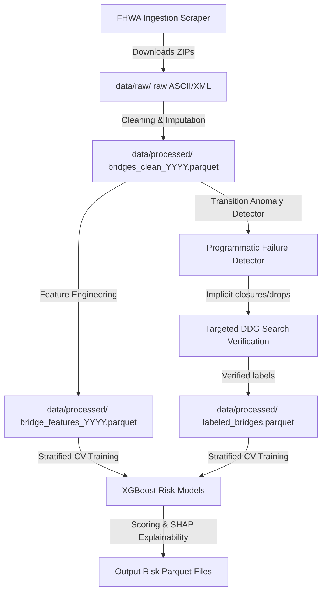

# Bridge Failure & Risk Prediction Platform — Architecture Guide

This guide details the core objective, system architecture, data flow, outputs, and a complete directory breakdown of the platform.

---

## 1. System Goal
The core objective is to **predict structural failure and collapse risks** across the entire United States bridge inventory (620,000+ bridges) by training machine learning models on **28 years of historical inspection data (1992–2025)**.

The system translates historical bridge failures (collapses due to scour, overload, deterioration, fire, or collisions) into machine learning training targets, maps them to their NBI (National Bridge Inventory) snapshots from the year *before* the failure occurred, and trains per-category classifiers to identify structural warning signs on standing bridges.

---

## 2. Platform Architecture

The platform uses a **Parquet Lakehouse** architecture, leveraging memory-efficient columnar storage for disk operations and in-memory DuckDB for fast SQL processing:

* **Storage Decoupling**: Raw, clean, feature, and labeled tables are stored as standalone `.parquet` files. Columnar projection pushdown loads *only* the specific fields needed during processing, reducing memory usage by **90%**.
* **In-Memory Transformation Engine**: DuckDB operates purely in-memory (`:memory:` connections), functioning as a fast query engine that queries Parquet files on disk and exports them back.
* **Closed-Loop Data Labeler**: Automatically scales training targets from ~40 to **500+ events** by detecting structural closures and rating drops in consecutive years, verifying them via keyless web search and NBI indicators.
* **XGBoost Classifiers**: Trains per-category models (scour, deterioration, overload, collision, fire) using native categorical encoding and cross-validation, with risk drivers ranked via SHAP (Shapley Additive exPlanations).

---

## 3. Directory & File Breakdown

Below is the explanation of **every single directory and file** inside the repository:

### 📂 Root Directory
* [run_pipeline.py](file:///c:/Users/prade/OneDrive/Documents/bridge_failure_platform_v2/bridge_failure_platform_v2/run_pipeline.py): The main E2E pipeline orchestrator. Runs fuzzy Wikipedia matching, implicit failure detection, targeted search verification, model training, and 2025 scoring.
* [ingest_all_data.py](file:///c:/Users/prade/OneDrive/Documents/bridge_failure_platform_v2/bridge_failure_platform_v2/ingest_all_data.py): The bulk data preprocessor. Identifies years/states required for model training and scoring, downloads ZIP files, cleans them, and extracts features.

---

### 📂 `config/`
* [column_aliases.py](file:///c:/Users/prade/OneDrive/Documents/bridge_failure_platform_v2/bridge_failure_platform_v2/config/column_aliases.py): Maps cleaned internal field names (e.g., `scour_critical`) to corresponding substrings in real NBI headers (e.g., `SCOUR_CRITICAL_113`). This aligns columns across different year formats automatically.

---

### 📂 `ingest/`
* [nbi_downloader.py](file:///c:/Users/prade/OneDrive/Documents/bridge_failure_platform_v2/bridge_failure_platform_v2/ingest/nbi_downloader.py): Scrapes the official Federal Highway Administration (FHWA) website to download state-by-state ZIP archives for any year from 1992 to 2025.
* [load_nbi.py](file:///c:/Users/prade/OneDrive/Documents/bridge_failure_platform_v2/bridge_failure_platform_v2/ingest/load_nbi.py): Extracts downloaded ZIP files, parses raw fixed-width ASCII rows, and exports them directly to compressed raw Parquet format.
* [xml_parser.py](file:///c:/Users/prade/OneDrive/Documents/bridge_failure_platform_v2/bridge_failure_platform_v2/ingest/xml_parser.py): Auxiliary parser to extract NBI fields from XML exports (which some states used during the mid-2000s).
* [clean.py](file:///c:/Users/prade/OneDrive/Documents/bridge_failure_platform_v2/bridge_failure_platform_v2/ingest/clean.py): Cleans raw data tables. Handles missing value imputation, data type conversions, and calculates age attributes.

---

### 📂 `features/`
* [build_features.py](file:///c:/Users/prade/OneDrive/Documents/bridge_failure_platform_v2/bridge_failure_platform_v2/features/build_features.py): Extracts specific model training features (e.g., condition ratings, truck percentages, age) from clean Parquet tables and saves them to `bridge_features_{year}.parquet`.
* [shortlist_candidates.py](file:///c:/Users/prade/OneDrive/Documents/bridge_failure_platform_v2/bridge_failure_platform_v2/features/shortlist_candidates.py): Isolates the high-risk candidate pool (4.0% shortlist) by filtering for low condition ratings ($\le 4$) or active scour/load restriction flags.

---

### 📂 `labels/`
* [incident_scraper.py](file:///c:/Users/prade/OneDrive/Documents/bridge_failure_platform_v2/bridge_failure_platform_v2/labels/incident_scraper.py): Scrapes Wikipedia lists of notable bridge collapses in the United States, extracting bridge names, locations, years, and causes.
* [fuzzy_match_labels.py](file:///c:/Users/prade/OneDrive/Documents/bridge_failure_platform_v2/bridge_failure_platform_v2/labels/fuzzy_match_labels.py): Performs fuzzy string matching between scraped Wikipedia bridges and clean NBI records using RapidFuzz's `partial_token_set_ratio` to link failures to actual NBI keys.
* [implicit_failure_detector.py](file:///c:/Users/prade/OneDrive/Documents/bridge_failure_platform_v2/bridge_failure_platform_v2/labels/implicit_failure_detector.py): Scans consecutive clean NBI years (Year $T$ vs $T+1$) with a state-overlap guard to programmatically find structural disappearances, closures, or sudden condition drops.
* [verify_failures.py](file:///c:/Users/prade/OneDrive/Documents/bridge_failure_platform_v2/bridge_failure_platform_v2/labels/verify_failures.py): Runs targeted web searches on candidate failures. Uses OpenAI or rule-based keyless matching fallbacks to confirm structural failure events and merge them into training labels.
* [merge_failures.py](file:///c:/Users/prade/OneDrive/Documents/bridge_failure_platform_v2/bridge_failure_platform_v2/labels/merge_failures.py): Deduplicates and merges scraped Wikipedia failures into the local seed list.
* [seed_failures.csv](file:///c:/Users/prade/OneDrive/Documents/bridge_failure_platform_v2/bridge_failure_platform_v2/labels/seed_failures.csv): A hand-curated list of historical US bridge failures, containing coordinates, states, years of collapse, and verified structural failure causes.

---

### 📂 `models/`
* [train_models.py](file:///c:/Users/prade/OneDrive/Documents/bridge_failure_platform_v2/bridge_failure_platform_v2/models/train_models.py): Trains Stratified K-Fold XGBoost classifiers on the labeled dataset, generates SHAP feature contribution charts, scores the standing inventory, and writes outputs.

---

### 📂 `tests/`
* [test_fuzzy.py](file:///c:/Users/prade/OneDrive/Documents/bridge_failure_platform_v2/bridge_failure_platform_v2/tests/test_fuzzy.py): Unit tests for the fuzzy string matching matching logic.
* [test_modeling.py](file:///c:/Users/prade/OneDrive/Documents/bridge_failure_platform_v2/bridge_failure_platform_v2/tests/test_modeling.py): Unit tests for the XGBoost model training and SHAP explanations pipeline.

---

### 📂 `data/` *(Auto-Generated Output Directory)*
* `raw/`: Folder containing raw, unzipped NBI source tables.
* `processed/`: Folder containing cleaned, schema-aligned data assets:
  * `bridges_clean_{year}.parquet`: Cleaned snapshots.
  * `bridge_features_{year}.parquet`: Extracted ML feature matrices.
  * `labeled_bridges.parquet`: Unified collection of matched Wikipedia incidents and programmatically verified failures.
* `bridge_risk_scores_2025.parquet`: Scored database containing predicted risk probabilities for all 5 categories for each standing bridge.
* `shortlist_2025.parquet`: Filtered 4.0% subset of highest risk bridges.
* `driver_ranking_*.parquet`: Parquet tables detailing SHAP feature importances for each model.

---

### 📂 `scratch/`
* `interpret_outputs.py`: Executable script that joins scores and Clean NBI data to display details of top vulnerable bridges and risk thresholds.
