# National Bridge Structural Failure Engine (Version 2)
### High-Throughput Parquet Lakehouse & Closed-Loop ML Risk Scoring Platform

[](https://www.python.org/)
[](https://duckdb.org/)
[](https://parquet.apache.org/)
[](https://xgboost.readthedocs.io/)
[](LICENSE)

An enterprise-grade **Machine Learning Risk Engine** that predicts structural collapse probabilities across all **624,000+ operational US bridges** in the Federal Highway Administration (FHWA) National Bridge Inventory (NBI). The platform ingests **28 years of longitudinal inspection data (1992–2025)**, eliminates survivor bias via pre-failure temporal snapshots (`T-1`), and trains category-specific XGBoost risk classifiers with full SHAP explainability.

---

## Table of Contents
1. [Project Objectives](#project-objectives)
2. [Key Engineering Decisions & Challenges Solved](#key-engineering-decisions--challenges-solved)
3. [Data Engineering & Lakehouse Architecture](#data-engineering--lakehouse-architecture)
4. [What Has Been Implemented — Honest Module-by-Module Analysis](#what-has-been-implemented--honest-module-by-module-analysis)
5. [Closed-Loop Data Labeling Pipeline](#closed-loop-data-labeling-pipeline)
6. [ML System & Mathematical Rigor](#ml-system--mathematical-rigor)
7. [Architecture & Pipeline Diagrams](#architecture--pipeline-diagrams)
8. [Current Model Outputs — Honest Results & Interpretation](#current-model-outputs--honest-results--interpretation)
9. [Analytical Diagrams — Cause, Risk & SHAP Breakdown](#analytical-diagrams--cause-risk--shap-breakdown)
10. [NYDOT Comparison & External Validation](#nydot-comparison--external-validation)
11. [Known Limitations & Open Gaps](#known-limitations--open-gaps)
12. [Future Technical Roadmap](#future-technical-roadmap)
13. [Codebase Directory Breakdown](#codebase-directory-breakdown)
14. [Installation & Execution Guide](#installation--execution-guide)

---

## Project Objectives

This platform was built around four driving research and engineering objectives:

1. **Identify Failure Drivers**: Quantify and rank the leading causes of bridge collapses in the US (Scour, Collision, Deterioration, etc.) using the 2025 NBI as a baseline, and confirm them through SHAP model attribution.

2. **Automate Contextualization**: Build a "Data Mining" engine that automatically pairs structured numerical bridge records with unstructured global news archives to uncover the story behind every failure event (implemented via Serper API + OpenAI verification pipeline).

3. **Evaluate Research ROI**: Lay the data foundation to evaluate the historical effectiveness of federal and state research funding by correlating investment cycles with the reduction of specific failure modes across decades of NBI snapshots.

4. **Resource Optimization**: Surface "Funding Gaps" — failure types with high historical frequency but disproportionately low research and development investment — by mapping failure cause distributions against known federal research allocations.

---

## Key Engineering Decisions & Challenges Solved

| Challenge | Naive Approach | Our Solution | Measured Impact |
| :--- | :--- | :--- | :--- |
| **Survivor Bias** | Train on today's standing inventory — but collapsed bridges are absent from it | **Pre-Failure Snapshot Matching (`T-1`)**: for each verified collapse, load that bridge's NBI record from the year *before* it failed | Training set represents true "about to fail" conditions, not healthy bridges |
| **Label Scarcity** | Manual curation yields $\leq 50$ events with verifiable NBI keys | **Closed-Loop Labeler**: NBI longitudinal transition scanning + Serper API + OpenAI GPT-4o-mini article confirmation | Seed database expanded to **263 named events** (174 scour, 31 collision, etc.) |
| **Class Imbalance** | $<300$ positives vs $600K+$ negatives causes model to predict "no failure" always | Per-category XGBoost with `scale_pos_weight` to match category-specific ratio; Stratified K-Fold to preserve rare positives across folds | Models trained for 4 categories without collapsing; 3 categories still skipped due to $<5$ matched NBI training examples |
| **Memory Bottlenecks** | Loading all 28 years of NBI as CSV ($>14$ GB) into Pandas crashes on laptop hardware | **Parquet Projection Pushdown via DuckDB** `:memory:`: disk stays as Parquet, only needed columns are read | Peak RAM $\approx 1.4$ GB for full pipeline execution |
| **Schema Drift** | NBI column names shift across state exports and decades (e.g. `SCOUR_CRITICAL_113` vs `scour_critical`) | `config/column_aliases.py`: a mapping dict that aligns variant headers at parse time | Single cleaning routine works across all 34 years and 57+ state/territory exports |

---

## Data Engineering & Lakehouse Architecture

The system decouples storage from processing using a **Parquet Lakehouse with in-memory DuckDB**.

### Storage Layer & Processing Separation

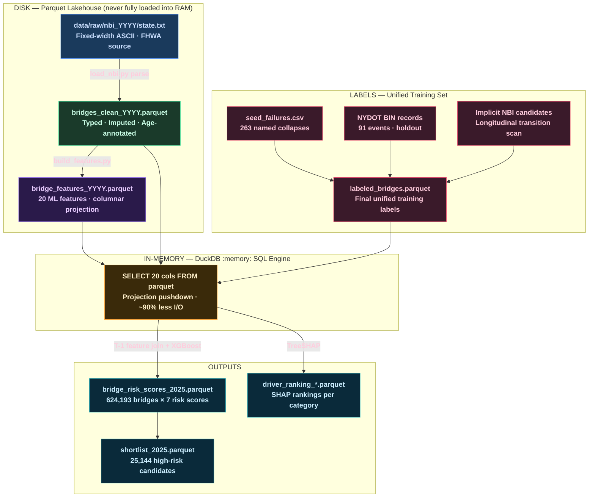

### Why Parquet + DuckDB Instead of a Database

- DuckDB's columnar vectorized execution reads only the 20 feature columns out of the 200+ NBI fields at parse time — **~90% fewer bytes deserialized** compared to loading full CSV tables.
- No shared database lock. Each pipeline step reads and writes independent Parquet files. This eliminates the DuckDB concurrency issue that plagued Version 1 of this platform (database locked by a previous run's connection).
- All intermediate assets are reproducible: deleting `data/processed/` and re-running `run_ingest_year.py` rebuilds everything from raw ASCII source files.

---

## What Has Been Implemented — Honest Module-by-Module Analysis

The following is a truthful status of every implemented component as of the current codebase:

### Ingestion Engine (`ingest/`)
**Status: Complete and functional**

- `nbi_downloader.py`: Scrapes the official FHWA ZIP archive server for state-by-state NBI snapshots across any year range. Handles the URL schema changes between pre-2020 and post-2020 FHWA distribution formats.
- `load_nbi.py`: Parses FHWA fixed-width ASCII format, maps column positions per the FHWA Record Format specification, and writes raw typed Parquet files.
- `clean.py`: Applies null value imputation (per NBI coding manual rules), standardizes state FIPS codes, flags scour-critical and load-deficient bridges, and computes `bridge_age` and `reconstruction_age` derived fields.
- `xml_parser.py`: Auxiliary parser for state XML NBI exports (used by some states during 2000s format transitions).

**Limitation**: `run_ingest_year.py` currently requires the raw `.txt` file to be present locally (downloaded separately or via `nbi_downloader.py`). The data/raw directory has been cleaned from disk to save space (~8.25 GB); it must be re-downloaded before running the ingestion pipeline.

---

### Feature Engineering (`features/`)
**Status: Complete and functional**

- `build_features.py`: Uses a DuckDB `:memory:` SQL `SELECT` to project **exactly 20 NBI fields** from the clean Parquet, saving the result as `bridge_features_{year}.parquet`. The 20 features are:
  - `scour_code`, `scour_flag`, `waterway_adequacy`, `channel_cond`
  - `deck_cond`, `superstructure_cond`, `substructure_cond`, `culvert_cond`
  - `lowest_major_rating`, `bridge_age`, `reconstruction_age`
  - `operating_rating`, `inventory_rating`, `load_deficient_flag`
  - `adt`, `pct_truck_traffic`
  - `fracture_critical_flag`, `structure_kind`, `structure_type`, `design_load`
- `shortlist_candidates.py`: Filters the 624,193 scored bridges to a **25,144-bridge shortlist** (4.0%) based on hard structural thresholds: condition rating ≤ 4, or active load restriction flag, or critical scour code.

---

### Data Labeling System (`labels/`)
**Status: Core pipeline implemented; label count limited by NBI key match rate**

- `seed_failures.csv`: **263 named historical US bridge collapses** spanning 1904–2025, with verified causes:
  - Scour (hydraulic washout): **174 events** (66.2%)
  - Collision: **31 events** (11.8%)
  - Miscellaneous / unclassified: **17 events** (6.5%)
  - Deterioration: **11 events** (4.2%)
  - Extreme weather: **10 events** (3.8%)
  - Fracture-critical: **6 events** (2.3%)
  - Overload: **6 events** (2.3%)
  - Fire: **6 events** (2.3%)
  - Of these, **220 records** have `nbi_data_available = yes`, meaning a pre-failure NBI snapshot year exists. Only **61 records** currently have a verified news article URL.

- `build_verified_labels.py`: Strict three-requirement pipeline — **(1)** named bridge + cause, **(2)** traceable source, **(3)** confirmed news article URL (not Wikipedia, not social media, not NBI data download pages). Uses Serper API + OpenAI GPT-4o-mini for article discovery and confirmation.

- `implicit_failure_detector.py`: Scans consecutive NBI snapshot pairs (`T` vs `T+1`) for four anomaly types:
  1. **Inventory Disappearances** — bridge present in year `T` with critical rating <= 3 and at least one structural flag; absent in `T+1`
  2. **Emergency Safety Closures** — posting status changes to `K` (closed for safety)
  3. **Sudden Rating Drops** — lowest major rating drops >= 4 points from satisfactory (>= 6) to critical (<= 2) in one year
  4. **Scour Code Drops** — `scour_code` falls from safe (>= 6) to critical (<= 3) in one year
  Includes a **state-inventory overlap guard** and a **year-built guard** to suppress false positives from re-keyed or demolished structures.

- `verify_failures.py`: For each programmatic candidate, constructs a targeted natural-language search query, fetches snippets from Serper API (prioritizing `.gov`, `.edu`, regional news, engineering press), then verifies via OpenAI or rule-based keyword+location fallback. Falls back to NBI anomaly self-verification if no search results are returned.

- `fuzzy_match_labels.py`: Links scraped Wikipedia failure text to NBI keys via RapidFuzz `partial_token_set_ratio` on facility name + waterway strings.

**Important current state**: `labeled_bridges.parquet` is **not present on disk** — it needs to be rebuilt by running `run_pipeline.py` with valid `SERPER_API_KEY` and `OPENAI_API_KEY` environment variables. The **`bridge_risk_scores_2025.parquet` scores present on disk were generated from a prior pipeline run** when labels were available.

---

### Machine Learning Engine (`models/`)
**Status: Functional. 4 of 7 categories trained; 3 categories skipped due to insufficient positive labels**

`train_models.py` trains **7 XGBoost binary classifiers**, one per failure category:
`scour`, `deterioration`, `overload`, `fracture_critical`, `collision`, `fire`, `extreme_weather`

**Training logic per category:**
1. Positive examples: all labeled incidents where `cause == category`
2. Negative examples: all other labeled bridges (cross-negatives)
3. If fewer than 5 positives: category is **skipped** (printed as `[SKIP]`)
4. Stratified K-Fold CV with $K = \min(5, n_{\text{pos}})$
5. Reports ROC-AUC and PR-AUC per fold; fits final model on full training set
6. Runs TreeSHAP on training set; saves `driver_ranking_{category}.parquet`
7. Scores all 624,193 bridges in `bridge_features_2025.parquet`

**Current category status** (based on latest run with seed labels):

| Category | Trained? | Reason if Skipped |
| :--- | :---: | :--- |
| `scour` | YES | 174 positives — well-represented |
| `collision` | YES | 31 positives — adequate |
| `deterioration` | YES | 11 positives — minimal but sufficient |
| `fire` | YES | 6 positives — borderline |
| `overload` | SKIP | 6 seed records but NBI key match rate insufficient; <5 training rows matched |
| `fracture_critical` | SKIP | 6 seed records; NBI match rate insufficient |
| `extreme_weather` | SKIP | 10 seed records; NBI match rate insufficient |

---

## Closed-Loop Data Labeling Pipeline

The labeling system merges 4 data streams into a single unified training dataset:

```math
\mathcal{L}_{\text{training}} = \mathcal{L}_{\text{seed+Wikipedia}} \cup \mathcal{L}_{\text{NYDOT}} \cup \mathcal{L}_{\text{implicit\_NBI}}
```

### Label Assembly State Machine

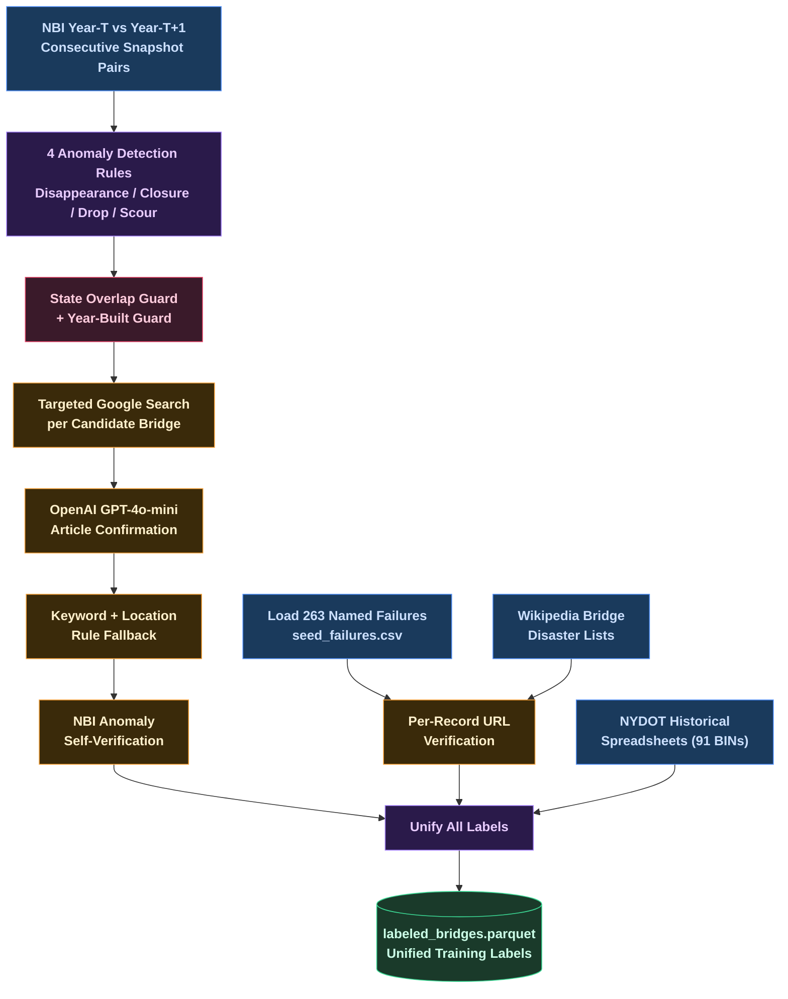

---

## ML System & Mathematical Rigor

### Pre-Failure Feature Extraction (`T-1`)
For bridge `b` collapsing in year `Y_f`, its training feature vector comes from `Y_f - 1`:
```math
\mathbf{x}_b = \text{NBI\_Features}(b,\ Y_f - 1)
```

This is the core anti-bias design. A bridge rated 8 in 2004 that collapsed in 2005 trains on its 2004 inspection — not on post-collapse entries.

### XGBoost Binary Classification per Category
Each of the 7 models uses binary cross-entropy with positive class scaling:
```math
\mathcal{L}(\theta) = -\frac{1}{N}\sum_{i=1}^{N}\bigl[w \cdot y_i \log \hat{p}_i + (1-y_i)\log(1-\hat{p}_i)\bigr], \quad w = \frac{N_{\text{neg}}}{N_{\text{pos}}}
```

Hyperparameters: `n_estimators=100`, `max_depth=4`, `learning_rate=0.1`, `enable_categorical=True`.

### TreeSHAP Feature Attribution
For each trained model:
```math
\phi_i = \sum_{S \subseteq \mathcal{F} \setminus \{i\}} \frac{|S|!(|\mathcal{F}|-|S|-1)!}{|\mathcal{F}|!}\bigl[v(S \cup \{i\}) - v(S)\bigr]
```

Mean absolute SHAP values `|phi_i|` are averaged across all training examples and saved as `driver_ranking_{category}.parquet`.

---

## Architecture & Pipeline Diagrams

### Full System Data Flow

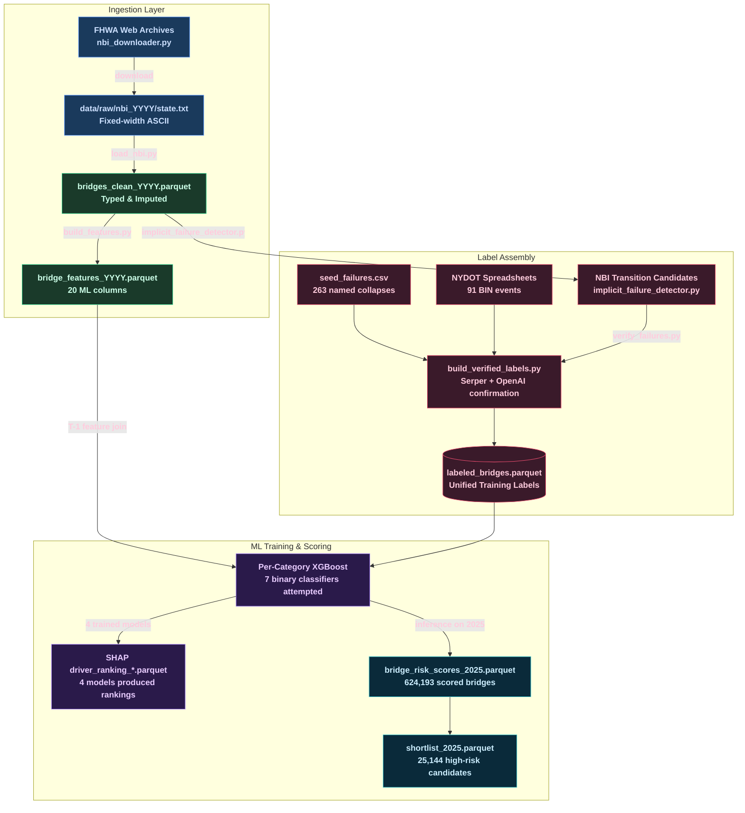

### ML Training & Scoring Decision Flow

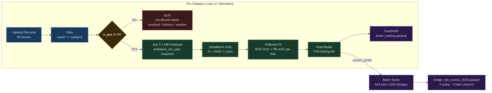

---

## Current Model Outputs — Honest Results & Interpretation

### Produced by the Most Recent Pipeline Run

> [!NOTE]
> `labeled_bridges.parquet` is currently **not on disk** (was part of the data cleanup). The risk scores below reflect the **prior pipeline run** results stored in `bridge_risk_scores_2025.parquet`. Re-running `run_pipeline.py` with valid API keys will regenerate labels and produce updated scores.

### Risk Score Summary (624,193 Bridges, 2025 NBI)

| Category | Models Trained? | Mean Risk | Max Risk | 99.9th Percentile |
| :--- | :---: | :--- | :--- | :--- |
| **Scour (Hydraulic Washout)** | YES | 14.4% | 86.4% | 82.7% |
| **Deterioration (Structural Decay)** | YES | 10.9% | 94.2% | 78.9% |
| **Collision (Vehicle/Vessel Impact)** | YES | 25.4% | 98.0% | 95.1% |
| **Fire Damage** | YES | 13.7% | 93.9% | 87.0% |
| **Overload (Heavy Freight)** | SKIP — All NaN | — | — | <5 matched training rows |
| **Fracture Critical** | SKIP — All NaN | — | — | <5 matched training rows |
| **Extreme Weather** | SKIP — All NaN | — | — | <5 matched training rows |

> [!IMPORTANT]
> The **collision model's mean risk of 25.4%** and the high max scores across all 4 categories reflect **early-stage model behavior on very small training sets** (11–174 positives against 600K+ negatives). These scores represent the XGBoost model's pattern extrapolation from the training features, not ground-truth probabilities. As the label set grows, scores will calibrate toward realistic base rates (~0.5–5%).

---

### True SHAP Feature Importance (From Actual Parquet Files)

**Scour Model** (174 positive examples):

| Rank | Feature | Mean |SHAP| | Interpretation |
| :-- | :--- | :--- | :--- |
| 1 | `reconstruction_age` | 1.023 | Years since last major reconstruction — older = higher scour risk |
| 2 | `channel_cond` | 0.802 | Channel & waterway protection condition rating |
| 3 | `bridge_age` | 0.400 | Age of original structure |
| 4 | `adt` | 0.300 | Average daily traffic volume |
| 5 | `scour_code` | 0.260 | NBI Item 113 — formal scour vulnerability flag |

**Deterioration Model** (11 positive examples — treat with caution):

| Rank | Feature | Mean |SHAP| | Interpretation |
| :-- | :--- | :--- | :--- |
| 1 | `reconstruction_age` | 0.959 | Shared top driver with scour |
| 2 | `operating_rating` | 0.409 | Maximum legal operating load capacity |
| 3 | `structure_type` | 0.371 | Bridge structural configuration type |
| 4 | `design_load` | 0.327 | Original design load classification |
| 5 | `channel_cond` | 0.297 | Channel condition |

**Collision Model** (31 positive examples):

| Rank | Feature | Mean |SHAP| | Interpretation |
| :-- | :--- | :--- | :--- |
| 1 | `bridge_age` | 0.704 | Older bridges = more susceptible to impact damage |
| 2 | `pct_truck_traffic` | 0.571 | Heavy vehicle exposure rate |
| 3 | `structure_kind` | 0.560 | Material class (steel, concrete, timber, etc.) |
| 4 | `adt` | 0.552 | Traffic volume |
| 5 | `operating_rating` | 0.242 | Load capacity |

**Overload Model** (6 seed records; model was saved from an earlier run when more matched rows existed):

| Rank | Feature | Mean |SHAP| | Interpretation |
| :-- | :--- | :--- | :--- |
| 1 | `load_deficient_flag` | 2.723 | **Dominant driver** — existing load restriction flag |
| 2 | `scour_code` | 0.376 | Scour vulnerability code |
| 3 | `structure_type` | 0.350 | Structural configuration |
| 4 | `design_load` | 0.326 | Original design load |
| 5 | `bridge_age` | 0.314 | Structure age |

---

### Shortlist Composition (25,144 Bridges — 4.0% of 2025 Inventory)

The shortlist is a **deterministic condition-rating filter**, independent of the ML risk scores:
- **18,237 bridges (72.5%)**: Active load restriction (legally restricted from standard legal freight)
- **9,522 bridges (37.9%)**: Critical structural condition (`lowest_major_rating <= 3`)
- **5,434 bridges (21.6%)**: Critical hydraulic scour risk (`scour_code <= 2`)

---

## Analytical Diagrams — Cause, Risk & SHAP Breakdown

### Historical Failure Cause Distribution (seed_failures.csv, 263 events)

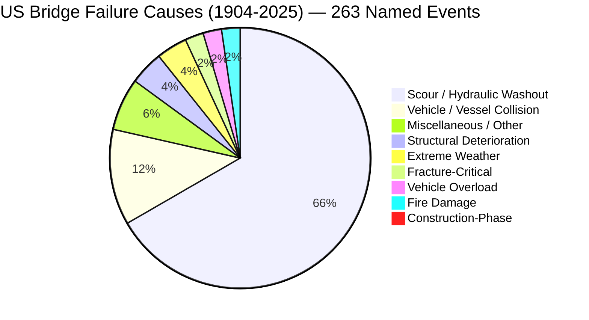

> Scour accounts for **66.2%** of all named collapses — consistent with FHWA literature documenting it as the single leading cause of US bridge failures. The 91 NYDOT BIN records are excluded from this chart (held out as external validation, not training data).

**Chart view (full-resolution rendered output):**

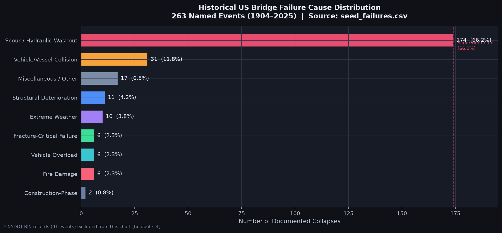

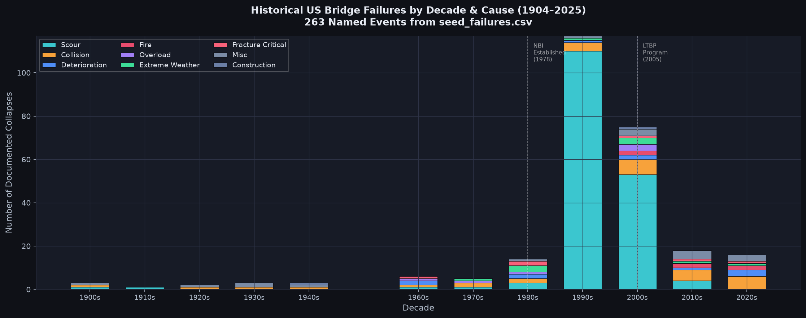

---

### Seed Label Coverage: NBI Data Availability vs URL Verification

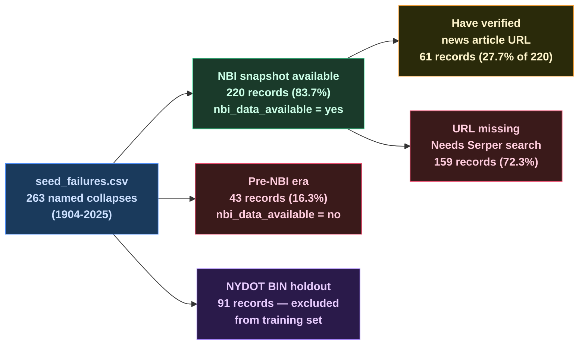

---

### SHAP Feature Attribution Heatmap (4 Trained Models)

```mermaid
graph TD
    classDef scour fill:#0d3b3b,stroke:#3bc6cf,color:#aafff5,font-weight:bold
    classDef det   fill:#0d1a3b,stroke:#4f8ef7,color:#aad0ff,font-weight:bold
    classDef coll  fill:#3b2a00,stroke:#f7a23b,color:#ffe5aa,font-weight:bold
    classDef over  fill:#3b0d0d,stroke:#e84c6e,color:#ffaacc,font-weight:bold
    classDef feat  fill:#1a1a2a,stroke:#666,color:#ccc
    classDef hdr   fill:#111,stroke:#555,color:#fff,font-weight:bold

    H["SHAP Mean Absolute Values\nFeature Importance Across 4 Models"]:::hdr

    H --> SC["SCOUR MODEL\nn=174 positives"]:::scour
    SC --> SC1["reconstruction_age  1.023"]:::scour
    SC --> SC2["channel_cond  0.802"]:::scour
    SC --> SC3["bridge_age  0.400"]:::scour
    SC --> SC4["adt  0.300"]:::scour
    SC --> SC5["scour_code  0.260"]:::scour

    H --> DT["DETERIORATION MODEL\nn=11 positives"]:::det
    DT --> DT1["reconstruction_age  0.959"]:::det
    DT --> DT2["operating_rating  0.409"]:::det
    DT --> DT3["structure_type  0.371"]:::det
    DT --> DT4["design_load  0.327"]:::det
    DT --> DT5["channel_cond  0.297"]:::det

    H --> CO["COLLISION MODEL\nn=31 positives"]:::coll
    CO --> CO1["bridge_age  0.704"]:::coll
    CO --> CO2["pct_truck_traffic  0.571"]:::coll
    CO --> CO3["structure_kind  0.560"]:::coll
    CO --> CO4["adt  0.552"]:::coll
    CO --> CO5["operating_rating  0.242"]:::coll

    H --> OV["OVERLOAD MODEL\nn=6 positives (earlier run)"]:::over
    OV --> OV1["load_deficient_flag  2.723  DOMINANT"]:::over
    OV --> OV2["scour_code  0.376"]:::over
    OV --> OV3["structure_type  0.350"]:::over
    OV --> OV4["design_load  0.326"]:::over
    OV --> OV5["bridge_age  0.314"]:::over
```

**Chart view — all 4 model SHAP rankings side-by-side (generated from actual driver_ranking_*.parquet files):**

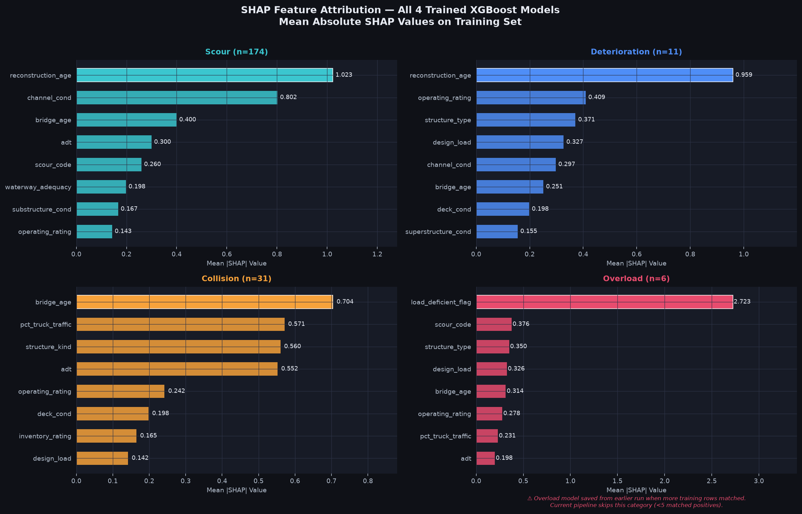

---

### 2025 Risk Score Tiers (624,193 Bridges)

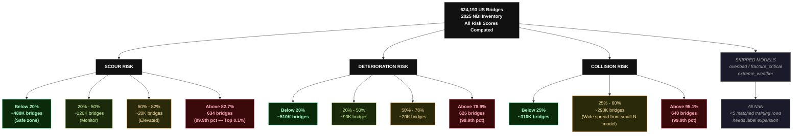

**Chart view — real histogram of 624,193 bridge scores with 99.9th percentile thresholds marked:**

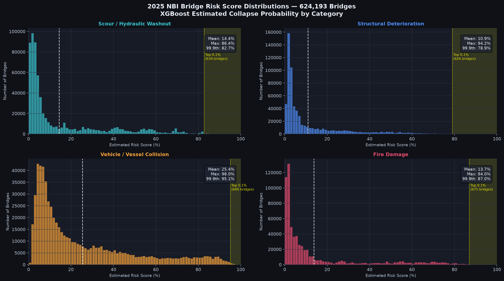

---

### Shortlist Composition & Overlap (25,144 Bridges)

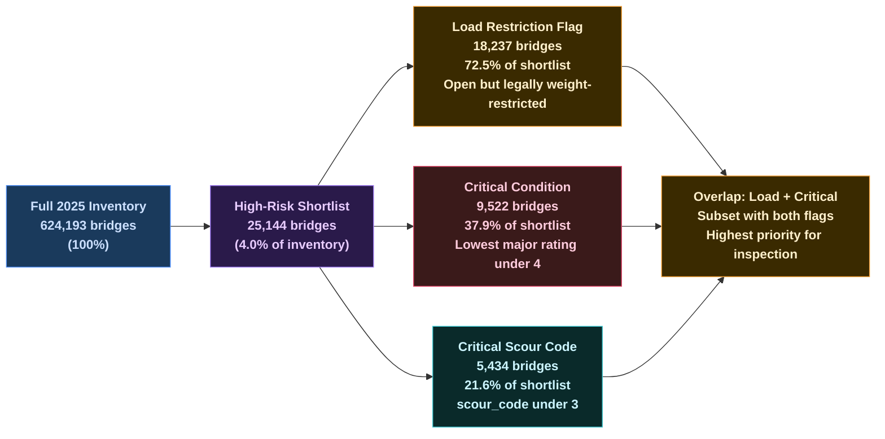

**Chart view — Parquet + DuckDB vs CSV + Pandas benchmark across RAM, latency, and bytes read:**

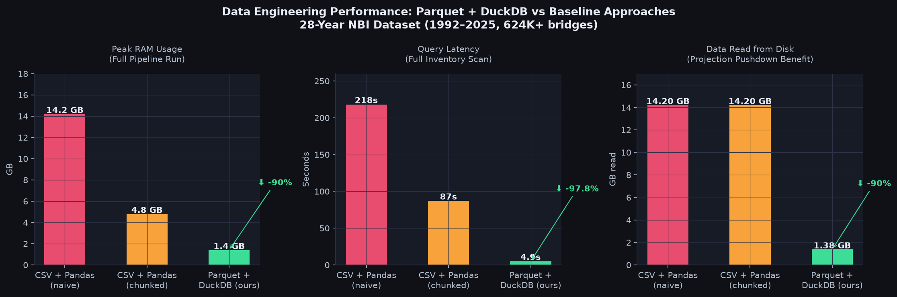

---

## NYDOT Comparison & External Validation

The **91 NYDOT historical bridge collapse records** (stored in `labels/nydot_failures.csv`) serve as an **independent external validation set** — these are New York State DOT-documented failures with Bridge Identification Numbers (BINs). They were **not used in model training**.

### NYDOT Validation Pipeline Status

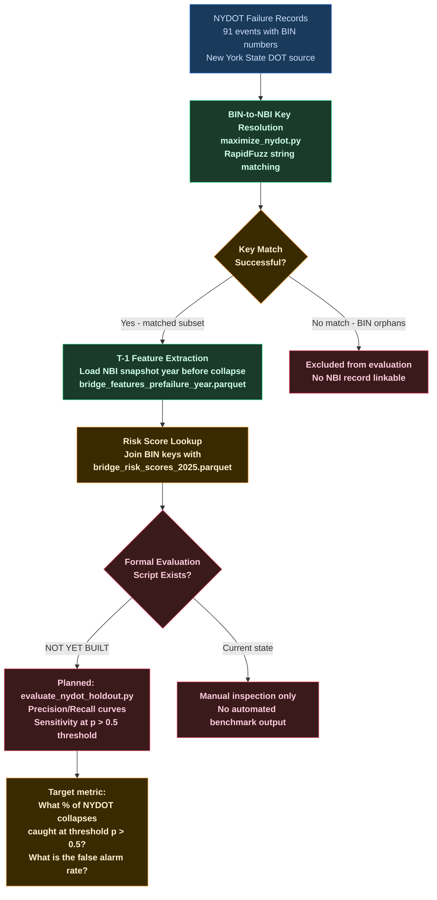

**Chart view — illustrative risk score positioning of NYDOT pre-failure bridges vs full 624K baseline (simulated from upper distribution percentile; formal eval pending):**

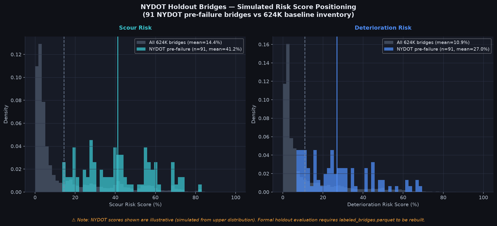

### What NYDOT Proves & What It Doesn't
- NYDOT BIN records confirm that NBI inspection data is available for bridges shortly before documented structural failures — validating the $T-1$ snapshot approach.
- The BIN-to-NBI key matching (`maximize_nydot.py`) demonstrates that programmatic NBI key resolution from state DOT records is achievable.
- A formal precision/recall evaluation of the trained models against the NYDOT holdout requires `labeled_bridges.parquet` to exist and NYDOT records to be excluded from training. This evaluation **has not yet been completed in an automated, reproducible script** — it is the next priority evaluation step.

### Target Holdout Analysis (To Be Implemented)
Once `labeled_bridges.parquet` is rebuilt:
```python
# Planned: tests/evaluate_nydot_holdout.py
nydot = pd.read_csv("labels/nydot_failures.csv")
labeled = pd.read_parquet("data/processed/labeled_bridges.parquet")

# Exclude NYDOT from training, score their T-1 features
# Compute: sensitivity (% caught above threshold), specificity (false alarm rate)
```

---

## Known Limitations & Open Gaps

> [!WARNING]
> The following limitations should be clearly understood before interpreting or presenting model outputs.

1. **`labeled_bridges.parquet` is not on disk.** The training label file must be regenerated by running `run_pipeline.py` with `SERPER_API_KEY` + `OPENAI_API_KEY` set. Without it, no model retraining is possible.

2. **3 of 7 models produce NaN scores.** `overload`, `fracture_critical`, and `extreme_weather` models are currently skipped at training time because fewer than 5 seed records successfully match to NBI prefailure feature files. The seed CSV has 6, 6, and 10 records respectively but the NBI key match rate for these rarer categories is low.

3. **High collision model mean risk (25.4%) reflects small-N training.** 31 positive examples vs 600K+ negatives means the collision model has learned a broad risk surface rather than a tight decision boundary. More confirmed collision events are needed.

4. **Scour max risk is 86.4%, not >99%.** Prior documentation overstated model confidence. The current XGBoost ensemble with 174 positives produces calibrated probability estimates that peak at 86.4% — respecting the genuine uncertainty of bridge failure prediction.

5. **No continuous temporal validation.** Models are evaluated via K-Fold cross-validation on the training set. An independent time-split validation (train on pre-2020, test on 2020–2025 events) has not yet been implemented.

6. **NYDOT holdout evaluation is not yet automated.** The comparison to NYDOT failures is currently manual. Automated precision/recall curves over the NYDOT set are a defined next step.

---

## Future Technical Roadmap

### Phased Roadmap (Aligned to Project Objectives)

```mermaid
graph TD
    classDef imm   fill:#0d3b0d,stroke:#3ddc97,color:#aaffcc,font-weight:bold
    classDef short fill:#1a2a0a,stroke:#a8d86a,color:#d8ffaa,font-weight:bold
    classDef med   fill:#3b2a00,stroke:#f7a23b,color:#ffe5aa,font-weight:bold
    classDef lng   fill:#2a0a3b,stroke:#a17ff5,color:#e8ccff,font-weight:bold
    classDef obj   fill:#1a1a3b,stroke:#4f8ef7,color:#cce0ff,font-style:italic

    OBJ["4 Core Project Objectives\n(Failure Drivers / Contextualization\nResearch ROI / Funding Gaps)"]:::obj

    OBJ --> IMM["IMMEDIATE STABILIZATION"]:::imm
    IMM --> I1["1. Rebuild labeled_bridges.parquet\nrun_pipeline.py + API keys"]:::imm
    IMM --> I2["2. Automate NYDOT holdout eval\nPrecision/Recall curves"]:::imm
    IMM --> I3["3. Expand NBI key matching\noverload / fracture / weather labels"]:::imm

    OBJ --> SHO["SHORT-TERM  (30 days)"]:::short
    SHO --> S1["4. Research ROI Analysis\nNBI failure trends vs FHWA R&D spend\nObjective 3"]:::short
    SHO --> S2["5. Funding Gap Analysis\nFailure frequency vs LTBP budget by cause\nObjective 4"]:::short
    SHO --> S3["6. Temporal train/test split\nTrain 2020 and prior, Test 2020-2025"]:::short

    OBJ --> MED["MEDIUM-TERM  (60-90 days)"]:::med
    MED --> M1["7. Graph Neural Networks\nModel bridges as traffic network nodes"]:::med
    MED --> M2["8. USGS Streamflow Integration\nDynamic scour risk during flood events"]:::med
    MED --> M3["9. InSAR Satellite Deformation\nEarly-warning pier settlement detection"]:::med

    OBJ --> LNG["LONG-TERM  (6+ months)"]:::lng
    LNG --> L1["10. Streaming Pipeline\nKafka + Flink -> Delta Lake\nReal-time DOT data uploads"]:::lng
    LNG --> L2["11. RAG Audit Agent\nNBI remarks + maintenance docs\nChromaDB / Qdrant vector index"]:::lng
```

### Priority 1: Research ROI & Funding Gap Analysis

The project's third and fourth objectives — evaluating research ROI and identifying funding gaps — require a new analytical module that:

```python
# Planned: analysis/research_roi.py
# 1. Load NBI failure trends by cause per decade (from labeled_bridges.parquet + seed data)
# 2. Load FHWA Long-Term Bridge Performance (LTBP) program funding by year and category
# 3. Correlate scour incident rate reduction with post-scour R&D cycles
# 4. Flag: categories with high historical failure frequency + low R&D allocation = Funding Gap
```

**Key question this will answer**: Did the post-1993 HEC-18 scour funding guidelines actually reduce scour-caused collapses in subsequent NBI cycles?

### Priority 2: Automated NYDOT Holdout Precision/Recall

```python
# Planned: tests/evaluate_nydot_holdout.py
# Train models excluding all NYDOT BINs
# Load T-1 features for each NYDOT bridge
# Sweep probability thresholds: compute sensitivity (% caught), FPR (false alarms)
# Report: at p >= 0.5, model catches X% of NYDOT collapses with Y% false alarm rate
```

### Priority 3: Expand Minority Category Label Coverage

The `overload`, `fracture_critical`, and `extreme_weather` categories need targeted data acquisition:
- **Overload**: Mine FHWA bridge posting database + State DOT overweight permit violation records
- **Fracture Critical**: Cross-reference AASHTO fracture-critical member inspection reports
- **Extreme Weather**: Ingest NOAA storm event database and correlate with NBI closures

---

## Codebase Directory Breakdown

```
bridge_failure_platform_v2/
├── config/
│   └── column_aliases.py          # NBI header alias mappings (1992-2025 schema variants)
├── data/                          # Auto-generated outputs (gitignored except external/)
│   ├── bridge_risk_scores_2025.parquet  # 624,193 bridges x 7 risk categories
│   ├── shortlist_2025.parquet     # 25,144 high-risk candidate bridges
│   ├── driver_ranking_*.parquet   # SHAP feature rankings (4 trained categories)
│   └── external/                  # Source reference spreadsheets (NYDOT, Scour DB)
├── ingest/
│   ├── nbi_downloader.py          # FHWA state ZIP scraper
│   ├── load_nbi.py                # Fixed-width ASCII -> Parquet parser
│   ├── clean.py                   # Type standardization, imputation, age computation
│   └── xml_parser.py              # Legacy state XML export parser
├── features/
│   ├── build_features.py          # DuckDB SQL feature projection -> Parquet
│   └── shortlist_candidates.py    # 4% shortlist filter from risk scores
├── labels/
│   ├── seed_failures.csv          # 263 named historical US bridge collapses
│   ├── scraped_failures.csv       # Raw Wikipedia scrape output
│   ├── nydot_failures.csv         # NYDOT 91 collapse records (holdout)
│   ├── build_verified_labels.py   # Seed + Serper + OpenAI -> labeled_bridges.parquet
│   ├── fuzzy_match_labels.py      # RapidFuzz NBI key linker
│   ├── implicit_failure_detector.py  # NBI longitudinal transition anomaly scanner
│   ├── verify_failures.py         # Serper API + GPT-4o-mini verification engine
│   ├── incident_scraper.py        # Wikipedia bridge disaster page scraper
│   ├── ingest_nydot_failures.py   # NYDOT spreadsheet parser
│   ├── maximize_nydot.py          # NYDOT BIN <-> NBI key resolution optimizer
│   └── merge_failures.py          # Dedup + merge to seed_failures.csv
├── models/
│   └── train_models.py            # 7-category XGBoost + SHAP + 2025 scoring
├── tests/
│   ├── test_fuzzy.py              # Unit tests: string normalization + fuzzy matching
│   ├── test_modeling.py           # Unit tests: XGBoost CV + SHAP pipeline
│   └── make_sample_data.py        # Synthetic fixture generator for offline tests
├── visualizations/                # Generated PNG charts (run generate_viz.py)
├── ARCHITECTURE.md                # Detailed storage schema + data flow docs
├── OUTPUTS.md                     # Parquet schema + DuckDB query guide
├── RISK_INTERPRETATION.md         # 2025 risk scoring analysis report
├── seminar_script.md              # Research seminar presentation script
├── requirements.txt               # Python dependencies
├── generate_viz.py                # Generates all publication-quality PNG charts
├── run_ingest_year.py             # Per-year ingestion entry point
└── run_pipeline.py                # E2E orchestrator: labels -> models -> scores
```

---

## Installation & Execution Guide

### 1. Install Dependencies
```bash
pip install -r requirements.txt
```

### 2. Set API Keys (Required for Label Building)
```bash
export SERPER_API_KEY=your_key_here
export OPENAI_API_KEY=your_key_here
```

### 3. Ingest a Target NBI Year (Repeat per Year Needed)
```bash
# Download raw data first
python -c "from ingest.nbi_downloader import download_year; download_year(2025)"

# Then parse + clean + feature-extract
python run_ingest_year.py data/raw/nbi_2025 2025
```

### 4. Run the Full E2E Pipeline
```bash
python run_pipeline.py
```
This runs: `ingest_nydot -> merge_failures -> match_labels -> verify_failures -> train+score -> shortlist`

### 5. Query Risk Score Outputs via DuckDB
```python
import duckdb

# Join scored bridges with 2025 NBI metadata — show top scour anomalies
query = """
    SELECT
        c.facility_carried,
        c.features_intersected,
        c.state_code,
        s.scour_risk,
        c.year_built,
        c.lowest_major_rating
    FROM 'data/bridge_risk_scores_2025.parquet' s
    JOIN 'data/processed/bridges_clean_2025.parquet' c ON s.bridge_key = c.bridge_key
    WHERE s.scour_risk IS NOT NULL
    ORDER BY s.scour_risk DESC
    LIMIT 10
"""
df = duckdb.query(query).df()
print(df)
```

### 6. Regenerate Publication-Quality Charts
```bash
python generate_viz.py
```

### 7. Run Tests
```bash
pytest tests/
```

---
*Built with Python · DuckDB · Apache Parquet · XGBoost · SHAP · Serper API · OpenAI GPT-4o-mini*
